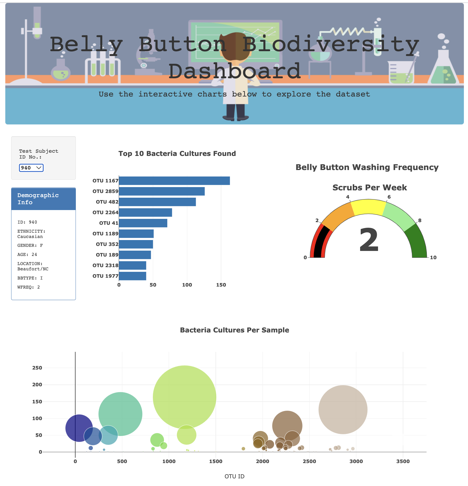

# Belly Button Biodiversity Dashboard

## Overview

### Purpose

The purpose of this analysis is to help Roza, a biological researcher, complete the Belly Button Biodiversity Dashboard. Using JavaScript and Plotly, interactive charts were created to visualize the bacterial data for each volunteer. As a result, Roza's volunteers are able to filter to their respective ID and identify their top 10 bacterial species in their belly buttons. The bacterial data is displayed in a horizontal bar chart, bubble chart and a gauge chart in addition to the demographic information for each volunteer. 

With this, if **Improbable Beef** identifies a species as a candidate to manufacture synthetic beef, Roza's volunteers will be able to identify whether that species is found in their navel.

Website: https://silviaeiden.github.io/Module12/

### Software and Web-Based Application

* JavaScript, or JS
* Plotly.js, a JavaScript data visualization library
* HyperText Markup Language, or HTML
* Google Chrome
* Visual Studio Code, or VS Code (Version 1.62.3)

